  <ul style="list-style: none">
    

      <h1> LuauDispatcher </h1>
    

  </ul>

An AST executor, meant for use with [vantoanvh's LuauParser](https://github.com/vantoanvh/LuauParser) to run luau code from anywhere.

Meant for use with LuauParser [v0.728](https://github.com/vantoanvh/LuauParser/releases/tag/v0.728)

Check out the [Docs](https://goobismoobis.github.io/LuauDispatcher)

# Benchmarks

These benchmarks compare code execution between the native roblox engine, LuauDispatcher + LuauParser, and vLuau (the current most popular luau code environment)

```mermaid
xychart-beta
    title "Native Roblox Engine (Lower is Better)"
    x-axis ["Sum Loop", "Complex Math", "Fib(15)", "Conditionals", "Array fill+sum", "Dict Mutation"]
    y-axis "Time (ms)" 0.0 --> 7.0
    
    bar "Native Luau" [0.00, 0.02, 0.04, 0.00, 0.01, 0.02]
    bar "Native Luau" [0.00, 0.02, 0.04, 0.00, 0.01, 0.02]
```

```mermaid
xychart-beta
    title "Native Roblox Engine (99.29% Smaller Scale)"
    x-axis ["Sum Loop", "Complex Math", "Fib(15)", "Conditionals", "Array fill+sum", "Dict Mutation"]
    y-axis "Time (ms)" 0.0 --> 0.05
    
    bar "Native Luau" [0.00, 0.02, 0.04, 0.00, 0.01, 0.02]
    bar "Native Luau" [0.00, 0.02, 0.04, 0.00, 0.01, 0.02]
```

```mermaid
xychart-beta
    title "vLuau (Lower is Better)"
    x-axis ["Sum Loop", "Complex Math", "Fib(15)", "Conditionals", "Array fill+sum", "Dict Mutation"]
    y-axis "Time (ms)" 0.0 --> 7.0
    
    bar "vLuau" [0.99, 1.41, 4.38, 1.93, 1.29, 1.45]
    bar "vLuau" [0.99, 1.41, 4.38, 1.93, 1.29, 1.45]
```

```mermaid
xychart-beta
    title "LuauParser + LuauDispatcher (Lower is Better)"
    x-axis ["Sum Loop", "Complex Math", "Fib(15)", "Conditionals", "Array fill+sum", "Dict Mutation"]
    y-axis "Time (ms)" 0.0 --> 7.0
    
    bar "LuauExecutor" [1.23, 0.71, 6.71, 0.91, 0.98, 0.53]
    bar "LuauExecutor" [1.23, 0.71, 6.71, 0.91, 0.98, 0.53]
```

| Test | Native (s) | Luau Executor (s) | vLuau (s) |
| ---- | ---------: | ----------------: | --------: |
| Arithmetic assignment loop (sum 1..1000) | 0.0000042049 | 0.0012328067 | 0.0009900933 |
| Complex math expressions (100 iterations) | 0.0000216428 | 0.0007105800 | 0.0014142333 |
| Recursive Fibonacci (15) | 0.0000358881 | 0.0067096533 | 0.0043807200 |
| Nested conditionals & logic operators | 0.0000040136 | 0.0009079267 | 0.0019265867 |
| Array fill + next/pairs sum iteration (n=300) | 0.0000115900 | 0.0009765667 | 0.0012851800 |
| Dictionary lookup and mutation | 0.0000230893 | 0.0005279267 | 0.0014516733 |

Compared to vLuau, LuauParser + LuauDispatcher is almost always faster, however it slows down extremely on large reccursive functions and long for loops. In general, vLuau is more consistant.

Choosing the right one for your usecase is a personal choice. If you want something tried-and-true that is consistant and easy, go with vLuau. If you want a much smaller module that has performance improvements but may be inconsistant, use LuauDispatcher + LuauParser.

# Contribute

Download the package from [Releases](https://github.com/GoobisMoobis/LuauDispatcher/releases/latest) and import it into Roblox. You can also download everything individually from [trueSrc](https://github.com/GoobisMoobis/LuauDispatcher/tree/main/trueSrc) however it's much harder because this is my first time uploading a package that I intend the general public to use. Most of the time I use my own system.
